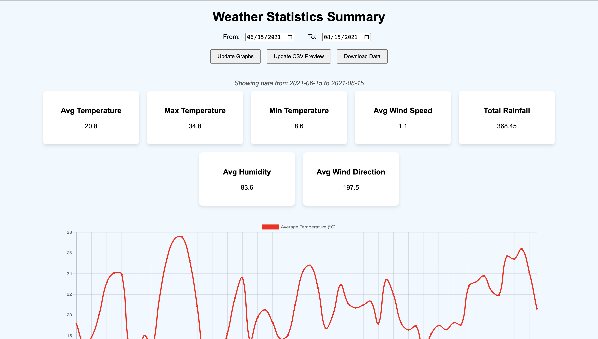
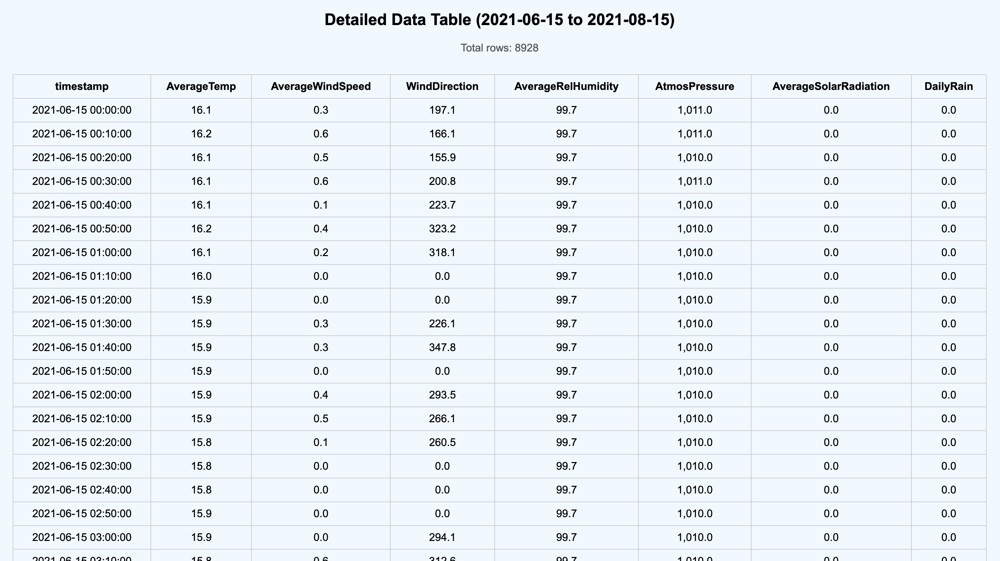

# PROJECT DOCUMENTATION  
#### Created: May 6, 2025  
#### Group Members: Feiran Chang, Elaine Chen, Quinn He, Zihan Lyu, Yijing Yin (in alphabetical order)  

### Purpose of the Project:  
The stakeholder needs an easy-to-use interface for accessing and analyzing meteorological data from MacLeish. The goal is to allow users to select a date range and specific weather parameters, generating computed metrics like average wind speed over different time scales. The system should be intuitive for users with little technical knowledge.  

### List of All Included Files and What Each One Does:  
- **whately10min.sql**: This file requires changes to the `LOAD DATA LOCAL INFILE '/Users/r3ttalynn/Desktop/2023_10min.csv'` directories. It imports data from 2019 to 2023 at 10-minute intervals.
- **css/index.css**: Controls the formatting of **index.php**.
- **php/index.php**: Fetches weather data from a MySQL database, allowing users to select a date range and view statistics in a table. It supports AJAX for dynamic graph updates, CSV previews, and downloads. Invalid date inputs are handled, and data is visualized using Chart.js with session-based user interaction management.
- **js/index.js**: Handles dynamic visualization and data display for the weather dashboard. It generates rainfall bar charts and wind rose charts using Chart.js, updates the data table based on pagination, and adjusts chart time units according to selected time ranges. It also manages the display of the latest data update timestamp.

### How to Set Up and Run the Project (Including Database Setup Instructions):  
1. **Create a New MySQL Connection**:  
   In MySQL Workbench, create a new connection named WhatelyMet. On the main page, right-click this connection and select *Edit Connection*. Navigate to the *Advanced* tab under *Connection* and add `OPT_LOCAL_INFILE=1` to the *Others* field.
   
2. **Establish the Connection and Create the Database**:  
   After configuring the connection, open it to access the MySQL server. Create a new SQL database to store the weather data.

3. **Configure PHP for Web-Server Access**:  
   Use the hostname and password associated with the WhatelyMet connection in your PHP code to establish the server connection.

4. **Integrate SQL with PHP and HTML**:  
   Integrate your SQL queries within the PHP and HTML files to enable dynamic data display and interaction through the web interface.

### Required Dependencies or Tools:  
- **SQL**: Used to read and pre-format (e.g., round to the desired decimal places) all the CSV files.  
- **PHP-SQL Connection**: Connect PHP files to the local SQL server to access the data from the CSV files.  
- **MAMP**: Used to run the PHP files and display them as a webpage.  
- **Aurora Server**: Intended to allow public access to the webpage (**not implemented yet**).

### Link to Presentation:  
[Google Presentation Link](https://docs.google.com/presentation/d/1hobnZ8jl3f_yl-stwc8xl8hMdXBw5P7oU-gmCqXu0Tk/edit?usp=sharing)  

# DESIGN SUMMARY  

### Key Design Decisions and Why They Were Made:  
To enable date range selection, we implemented a **From** and **To** selection tab at the top of the webpage. This is followed by three JavaScript-controlled buttons: **Update Graphs**, **Update CSV Preview**, and **Download Data**.  

Next, there is a **weather data summarization section** with seven cards displaying the following metrics:  
- Avg Temperature  
- Max Temperature  
- Min Temperature  
- Avg Wind Speed  
- Total Rainfall  
- Avg Humidity  
- Avg Wind Direction  

Below this section, we included a **daily averaged weather variable line graph** to help users better visualize the data.  

At the bottom of the webpage, there is a **CSV table preview** (showing 50 lines by default), which displays all the data from the selected date range.  

### Major Challenges Encountered During Development:  
The first challenge we encountered was importing data from local datasets into tables in MySQL Workbench. We faced persistent access denials. However, after referring to resources Sian provided, we resolved this issue by changing an advanced setting in our MySQL connection. Another major challenge was editing the decimal places of table entries based on Paul’s request. Specifically, we were able to successfully change the table displayed in MySQL Workbench, but the table on our web interface wasn’t updated. We eventually solved this problem using the `ALTER TABLE` and `Modify` query.  

### Screen Shots

# USER INSTRUCTION  

To run the current version, the user must have a local PHP server (e.g., MAMP).  
The user can select a date range and click the buttons to update visualizations, preview the CSV, and download the data in CSV format.  

# FUTURE DIRECTORIES  

## SERVER ACCESS  

1. Request Aurora server access (email: cats-s@smith.edu), and cc Halie and Paul.  
   - This will allow people outside the network to access the server directly.  

2. Connect to the MacLeish server.  

## WEBPAGE FUNCTIONALITIES  

During our meeting with stakeholder Paul Wetzel on May 6, we presented the current version of the webpage. Paul mentioned that the weather data measuring instruments are not accurate enough to display values to three decimal places. He would like us to:  
- Round **solar radiation** and **rainfall** data to **two decimal places**  
- Round all **other variables** to **one decimal place**  

### 1. Diagnostic Section (Admin)  
- Filter out incorrect data caused by instrument malfunction.  
- Admins should have access to modify and push the corrected data.  

### 2. Feature Selection  
- Include checkboxes to select different features/visualizations.  

### 3. Visualization  
- Some data are highly variable, including:  
  - Temperature  
  - Rainfall  
  - Display 10-minute wind speed (max and min) would be more intuitive  
  - Photosynthetic radiation  

### 4. Data Granularity Option  
- Allow users to choose between viewing:  
  - Daily data  
  - 10-minute interval data